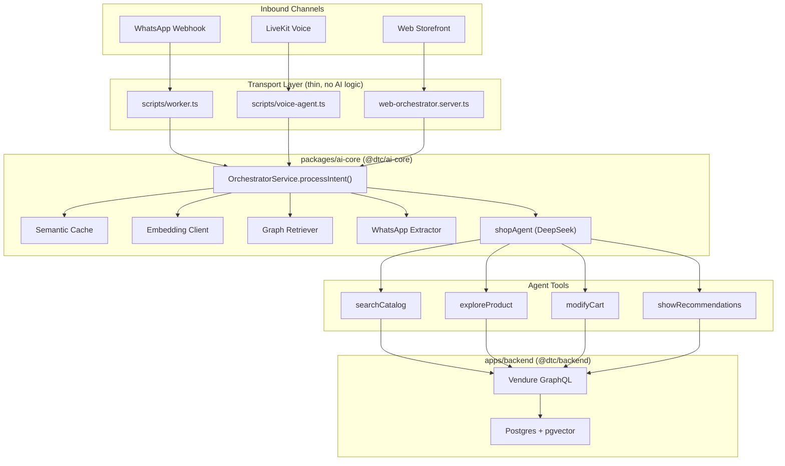
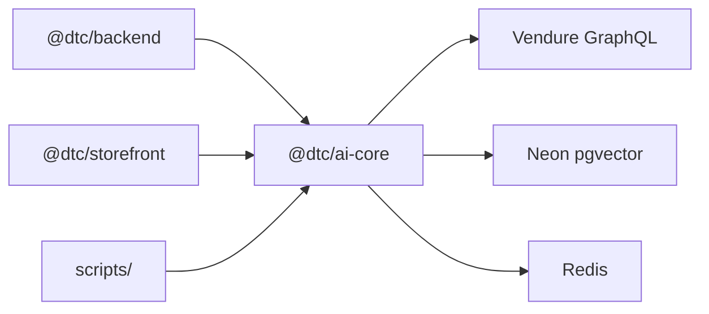

# AURA — Architecture Overview

An AI-powered luxury minimalist apparel storefront. Customers interact through
the **Remix web storefront**, **WhatsApp**, or **LiveKit voice**. All three
channels converge on a single AI orchestration pipeline in `@dtc/ai-core`.

**Commerce backend:** [Vendure](https://www.vendure.io/) (GraphQL + TypeORM + Postgres/pgvector).

---

## 1. System Diagram



### Dependency Graph (no circular imports)



---

## 2. How a Message Flows

### Step by step (all channels)

1. **Transport layer** receives the message (web action, BullMQ worker, or LiveKit STT)
2. **OrchestratorService.processIntent()** in `@dtc/ai-core/orchestrator`:
   - **Step 1:** Check semantic cache (Neon pgvector) — hit returns instantly
   - **Step 2:** Context hydration — embed query, vector search, variant hydration, graph expansion
   - **Step 3:** WhatsApp only — classify via `extractPayloadData` (Gemini Flash)
   - **Step 4:** Call `shopAgent.generate()` with Redis session history + grounded context
   - **Step 5:** Cache the response (Neon pgvector)
   - **Step 6:** Append turns to Redis session
   - **Step 7:** Return `{ text, toolResults, fromCache }`
3. **Platform adapter** dispatches the response (Meta Graph API, TTS stream, or Remix UI)

### Channel entry points

| Channel | Transport file | Orchestrator import |
|---------|---------------|---------------------|
| Web | `apps/storefront/app/routes/_index.tsx` → `web-orchestrator.server.ts` | `@dtc/ai-core/orchestrator` |
| WhatsApp | `scripts/worker.ts` | `@dtc/ai-core/orchestrator` |
| Voice | `scripts/voice-agent.ts` | `@dtc/ai-core/orchestrator` |

---

## 3. File Map

| Concern | File | Package |
|---------|------|---------|
| Web entry | `apps/storefront/app/routes/_index.tsx` | storefront |
| Web-to-orchestrator bridge | `apps/storefront/app/domains/orchestrator/web-orchestrator.server.ts` | storefront |
| The brain | `packages/ai-core/src/orchestrator.ts` | **ai-core** |
| AI agent | `packages/ai-core/src/agents/shopAgent.ts` | **ai-core** |
| Embeddings | `packages/ai-core/src/embedding.client.ts` | **ai-core** |
| Semantic cache | `packages/ai-core/src/cache-engine.ts` | **ai-core** |
| Graph expansion | `packages/ai-core/src/graph-retriever.ts` | **ai-core** |
| WhatsApp classifier | `packages/ai-core/src/extractor.ts` | **ai-core** |
| Agent tools | `packages/ai-core/src/tools/*.ts` | **ai-core** |
| WhatsApp transport | `scripts/worker.ts` | scripts |
| Voice transport | `scripts/voice-agent.ts` | scripts |
| Backend re-export | `apps/backend/src/domains/orchestrator/orchestrator.service.ts` | backend |

Storefront keeps thin `.server.ts` re-export proxies for Remix server-boundary enforcement. All implementation lives in `@dtc/ai-core`.

---

## 4. Directory Map

```
aura/
├── agents.md
├── design.md
├── package.json                 # Monorepo root (pnpm + turbo)
│
├── packages/
│   └── ai-core/                 # @dtc/ai-core — shared AI pipeline
│       └── src/
│           ├── orchestrator.ts       ← THE SINGLE BRAIN
│           ├── cache-engine.ts
│           ├── embedding.client.ts
│           ├── graph-retriever.ts
│           ├── extractor.ts
│           ├── agents/shopAgent.ts
│           ├── tools/                  # searchCatalog, exploreProduct, modifyCart, showRecommendations
│           └── __tests__/
│
├── apps/
│   ├── backend/                 # @dtc/backend — Vendure commerce
│   │   └── src/domains/orchestrator/
│   │       └── orchestrator.service.ts   ← re-exports from @dtc/ai-core
│   │
│   └── storefront/              # @dtc/storefront — Remix UI
│       └── app/
│           ├── routes/
│           ├── domains/         # thin re-export proxies to @dtc/ai-core
│           └── mastra/          # Mastra instance wiring
│
├── scripts/
│   ├── worker.ts
│   ├── voice-agent.ts
│   ├── eval-rag.ts              # RAG benchmark (manual)
│   └── ast-firewall.ts
│
└── .knowledge/                  # Architecture documentation (you are here)
```

---

## 5. RAG Pipeline (Vector + Graph Hybrid)

```
User Query
    │
    ▼
Gemini embed-2 (768-dim vector)
    │
    ▼
pgvector cosine similarity (<=>) on Vendure Postgres
    │  top-3 product seeds
    ▼
Phase 1: Live variant hydration (price/SKU/availability)
    │
    ▼
Phase 2: Graph expansion
    │  semantically related products via embedding similarity
    │  variant data from product_variant table
    ▼
Merged context block → shopAgent → tool calls → response
```

**Graph hops tracked in OTel spans:** `graph-expand` → `graph-hop-1` → `graph-hop-2`

**Graceful degradation:** If graph expansion fails, pipeline falls back to vector-only context.

### Semantic Cache

Separate Neon database (`ai_cache.cache_embeddings`). Before the main pipeline,
checks if a similar query (cosine distance < 0.05) was cached — returns instantly on hit.

---

## 6. Tests

| Test file | What it proves |
|-----------|---------------|
| `embedding.client.test.ts` | Gemini embedding wrapper: happy path, missing key, API errors |
| `graph-retriever.test.ts` | Graph expansion assembly with mock pool |
| `orchestrator.test.ts` | Session key format, cache payload Zod schemas |
| `tools.test.ts` | Mastra tool input schema constraints |

Run: `pnpm test`

### RAG Evaluation (manual benchmark)

```bash
node --experimental-strip-types scripts/eval-rag.ts
```

18 queries with expected product slugs. Outputs Recall@3 and MRR to `scripts/eval-rag-report.json`.

---

## 7. Conventions

### AST Firewall (21 rules, enforced at compile time)

Run with `pnpm check:firewall` (or `pnpm verify-agent` for watch mode).
Scans `packages/ai-core/src/`, storefront domains, backend domains, and scripts.

| Rule | What it enforces |
|------|-----------------|
| 1 | GraphQL client isolation |
| 2 | Mastra tool schemas must have size constraints |
| 11 | Only allowed AI models (DeepSeek, Gemini) |
| 13 | Cart tools require `idempotencyKey: z.string().uuid()` |
| 14 | No naked `fetch`/`axios` — must be Zod-wrapped |
| 16 | Semantic cache queries must use `<=>` operator |
| 19–21 | Type safety on catch blocks, no `any`, no `z.any().parse()` |

### Structured Errors

Defined in `packages/ai-core/src/errors.ts`, re-exported by storefront proxies:

| Class | Boundary | Example codes |
|-------|----------|---------------|
| `IntegrationError` | Third-party APIs | `CONFIG_MISSING`, `UPSTREAM_API_ERROR` |
| `DatabaseDomainError` | pg Pool, cache | `GRAPH_TRAVERSAL_FAILED`, `CACHE_WRITE_FAILED` |

---

## 8. Environment Configuration

| File | Process | Key vars |
|------|---------|----------|
| `apps/backend/.env` | Vendure server | `DB_*`, `REDIS_URL` |
| `apps/storefront/.env` | Remix + Mastra | `VENDURE_API_URL`, `DEEPSEEK_API_KEY`, `PAYLOAD_DATABASE_URL`, `EMBEDDING_API_KEY` |
| `scripts/.env` | Worker + Voice | `WHATSAPP_ACCESS_TOKEN`, `LIVEKIT_*`, `DEEPGRAM_API_KEY`, `CARTESIA_API_KEY` |

---

## 9. Starting the System

See [`.knowledge/runbook.md`](runbook.md) for the full demo guide.

| Terminal | Command | Purpose |
|----------|---------|---------|
| 1 | `pnpm verify-agent` | AST guardrails |
| 2 | `pnpm backend:dev` | Vendure on :3000 |
| 3 | `pnpm storefront:dev` | Remix on :5173 |
| 4 | `node --experimental-strip-types scripts/worker.ts` | WhatsApp worker |
| 5 | `node --experimental-strip-types scripts/voice-agent.ts dev` | Voice agent |

---

## 10. Design Decisions

| Decision | Why |
|----------|-----|
| `@dtc/ai-core` shared package | Eliminates circular cross-app imports; single home for AI pipeline |
| OrchestratorService as single source of truth | All channels share identical intent resolution |
| Storefront re-export proxies | Preserves Remix `.server.ts` server-boundary tree-shaking |
| Zod at every boundary | Fail fast on malformed data |
| AST firewall (not ESLint) | Compile-time enforcement can't be bypassed |
| Kysely for vector queries | Type-safe SQL, reuses TypeORM pool |
| Separate Neon DB for cache | Cache operations never touch commerce DB |
| DeepSeek for agent, Gemini for embeddings | Best model per task |
